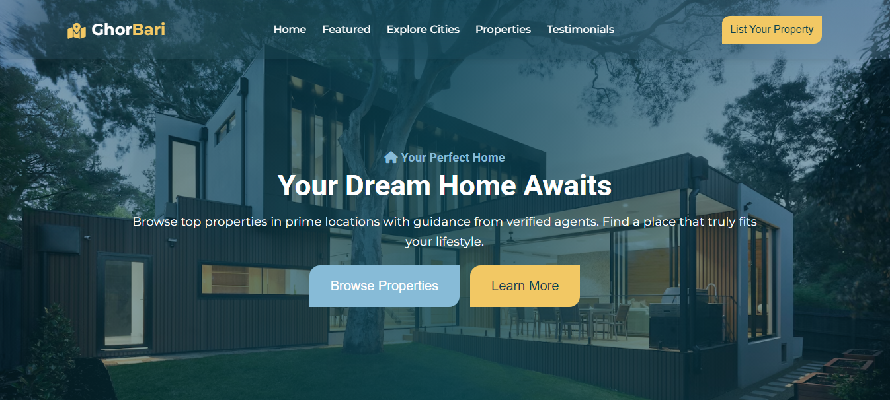

# 🏙️ Real Estate HTML Template

A modern, responsive, and well-structured Real Estate HTML template designed for property listing websites, realtors, and agencies. Built using semantic HTML5, CSS3, and minimal JavaScript — with mobile-first responsiveness and developer-friendly code.

---

## 📁 Folder Structure

```plaintext
📦 Project Root
├── 📂 public
│   ├── 📂 styles
│   │   └── styles.css        # Main stylesheet
│   ├── 📂 js
│   │   └── index.js          # JavaScript for navbar and scroll effects
│   └── 📂 images             # All images used in the template
├── 📂 vendor
│   └── grid.css              # External grid layout CSS library
├── index.html                # Main HTML file
```

---
## 🎨 Stylesheet Overview

All styling for the template is contained within the `styles.css` file located in the `public/styles/` folder.  
This file includes styles for the entire template — from the navbar and hero section to featured properties, testimonials, footer, and responsive breakpoints.

You can customize colors, layouts, and responsiveness by editing this single stylesheet.

## 🚀 Features

- ✅ Fully responsive layout (mobile-first)
- ✅ Clean and semantic HTML5 structure
- ✅ Custom utility classes for easy design consistency
- ✅ Modern grid system (included in `vendor/grid.css`)
- ✅ Easy-to-read code and well-commented stylesheets
- ✅ Lightweight JavaScript without frameworks
- ✅ Cross-browser compatibility
- ✅ SEO-optimized structure

---

## 📷 Screenshots

### Home Page


---

## 🛠️ How to Use

1. **Clone or Download** the project files.
2. Open `index.html` in your browser or a code editor.
3. Customize the content, images, and styles as needed.
4. Upload to your web hosting or marketplace (e.g., TemplateMonster).

---

## 📚 Credits

- **Images**  
  - Kitchen, Living Room, Front View, Apartment, etc.  
    Sources:  
    - [Pixabay](https://pixabay.com)  
    - [Unsplash](https://unsplash.com)  
    - [Pexels](https://www.pexels.com)  

- **Icons & Fonts**  
  - Font Awesome (CDN) — [https://fontawesome.com/](https://fontawesome.com/)  
  - Google Fonts (used in CSS)

- **Grid System**  
  - Custom grid library included in `vendor/grid.css`

---

**Note:**  
Make sure to verify and comply with each image platform’s license terms. All images used are free for commercial use with no attribution required, but attribution is given here out of courtesy.

---

## 📄 License

This template is licensed for use under ---.

---

## 🙌 Author

**MD AL HASAN NIROB**  
Front-End Developer | HTML, CSS, JavaScript, React.js  
🇧🇩 Bangladesh  
